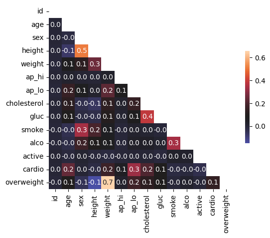

# Medical Data Visualizer

This project processes and visualizes patient health data to identify trends and relationships between various medical indicators and cardiovascular disease. It includes a categorical plot comparing health metrics across active and sedentary groups and a heatmap highlighting correlations between variables.

## Goals
- Analyze patient health data to identify factors correlated with cardiovascular disease.
- Provide visualizations for easy interpretation of complex medical data.

### **3. Data Description**

| **Feature**                       | **Variable Type**      | **Variable**        | **Value Type**                                          |
|------------------------------------|------------------------|---------------------|--------------------------------------------------------|
| **Age**                           | Objective Feature      | `age`               | `int` (days)                                           |
| **Height**                        | Objective Feature      | `height`            | `int` (cm)                                            |
| **Weight**                        | Objective Feature      | `weight`            | `float` (kg)                                          |
| **Gender**                        | Objective Feature      | `gender`            | Categorical code                                       |
| **Systolic Blood Pressure**       | Examination Feature    | `ap_hi`             | `int`                                                 |
| **Diastolic Blood Pressure**      | Examination Feature    | `ap_lo`             | `int`                                                 |
| **Cholesterol**                   | Examination Feature    | `cholesterol`       | `1`: normal, `2`: above normal, `3`: well above normal |
| **Glucose**                       | Examination Feature    | `gluc`              | `1`: normal, `2`: above normal, `3`: well above normal |
| **Smoking**                       | Subjective Feature     | `smoke`             | Binary (`0`: no, `1`: yes)                            |
| **Alcohol Intake**                | Subjective Feature     | `alco`              | Binary (`0`: no, `1`: yes)                            |
| **Physical Activity**             | Subjective Feature     | `active`            | Binary (`0`: no, `1`: yes)                            |
| **Presence of Cardiovascular Disease** | Target Variable | `cardio`            | Binary (`0`: no, `1`: yes)                            |

#### **Key Insights**
- The dataset includes objective measurements such as **age**, **height**, and **weight**, as well as examination results like **blood pressure** and **cholesterol levels**.
- Subjective health indicators, such as **smoking**, **alcohol consumption**, and **physical activity**, provide additional context for lifestyle choices.
- The **target variable**, `cardio`, indicates whether a patient has been diagnosed with cardiovascular disease.

## Visualisations
- **Categorical Plot**: Displays distributions of health metrics (e.g., cholesterol, BMI) for patients with and without cardiovascular disease.
  
  - **Activity**: Dataset suggests that a slightly larger proportion of patients without cardiovascular disease are physically active compared to those with the disease.
  -**Cholesterol and Glucose**: High cholesterol and glucose levels are more frequent in patients with cardiovascular disease.
  -**Overweight**: Overweight individuals are prevalent in both groups but are slightly more common in the cardiovascular disease group.
  
- **Heatmap**: Highlights correlations between variables such as blood pressure, cholesterol, and BMI.
  -Weight and height exhibit a moderate correlation (**0.5**), indicating taller individuals tend to weigh more.
  -Systolic (ap_hi) and diastolic (ap_lo) blood pressures have a mild positive correlation (**0.4**).
  -Overweight status is strongly correlated with weight (**0.7**), as expected from the BMI calculation.
  -Cardiovascular disease is moderately correlated with diastolic (ap_lo) blood pressure (**0.3**) and slightly correlated with cholesterol (**0.2**), age (**0.2**), and weight (**0.2**)
  
  
